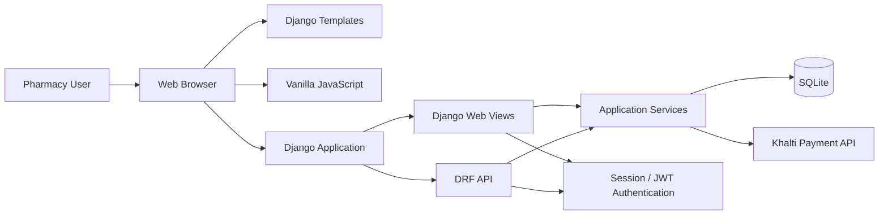
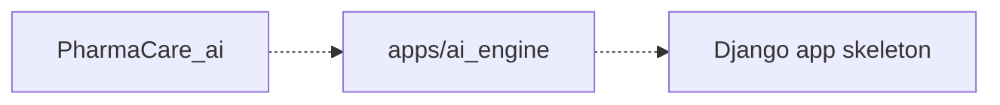
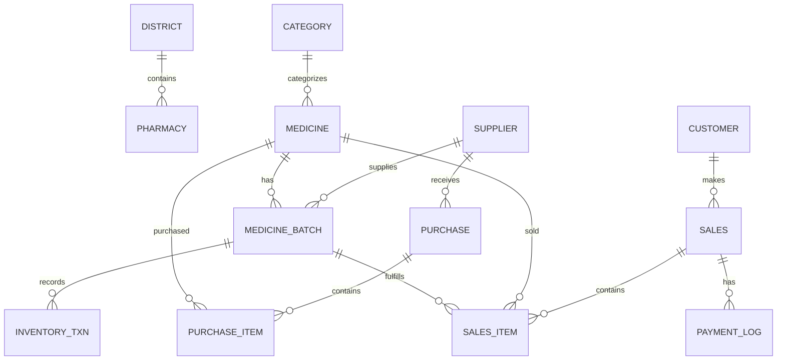
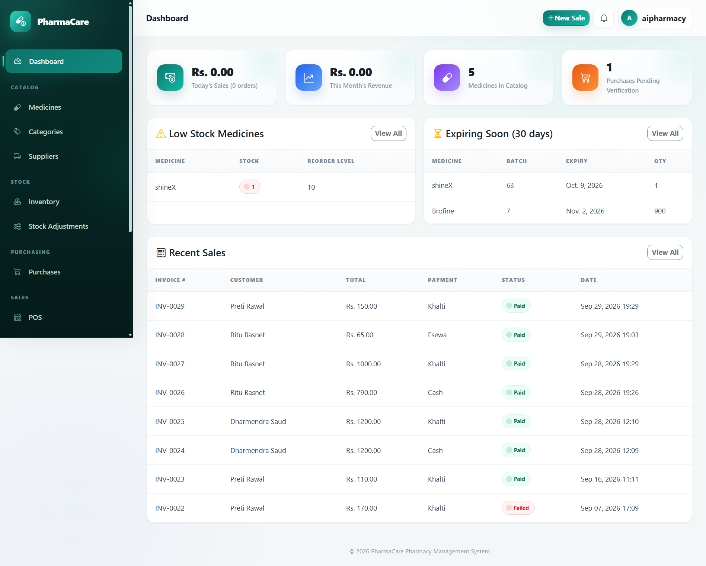
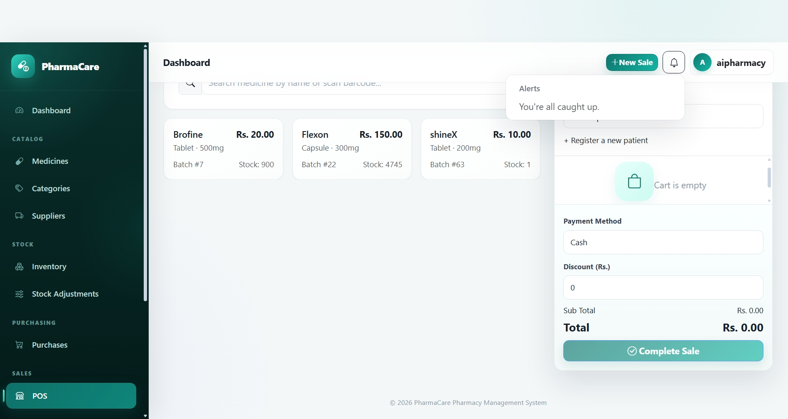
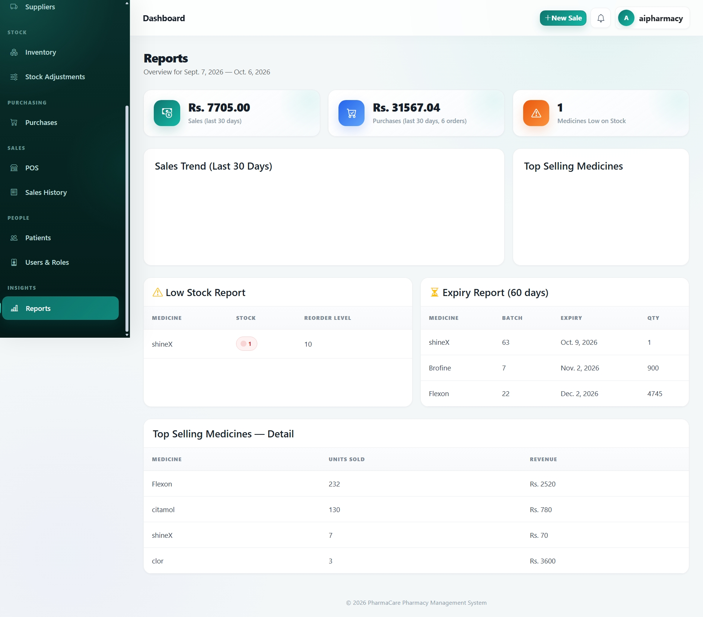
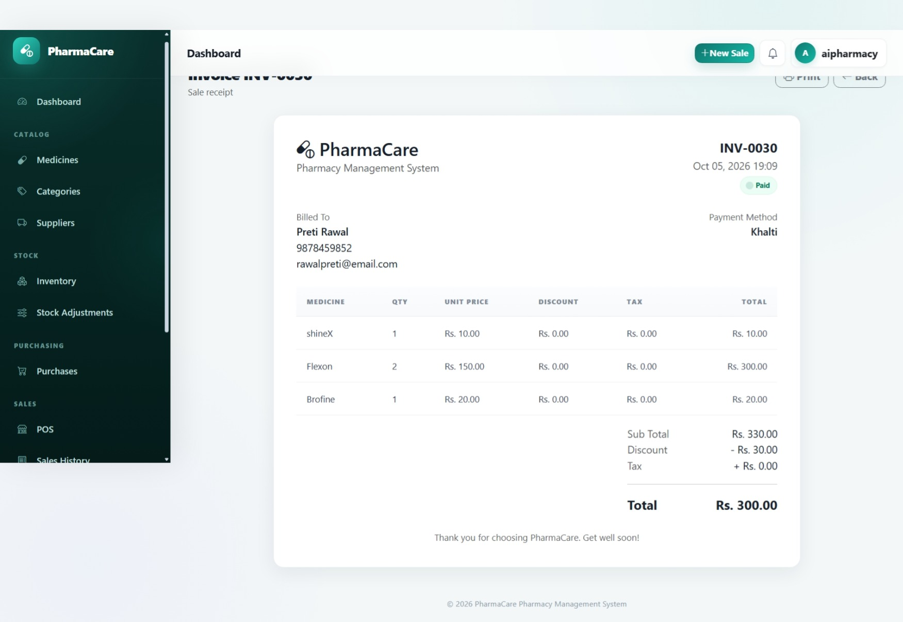
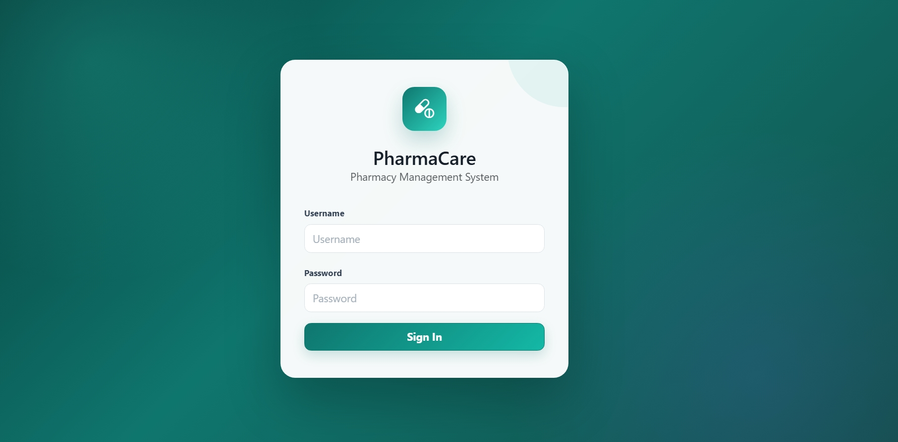

# PharmaCare_ai

PharmaCare_ai is a Django-based pharmacy management system for managing medicines, medicine batches, inventory, purchases, sales, patients/customers, suppliers, pharmacy information, reporting, user accounts, and Khalti payments.

The repository contains a server-rendered Django web application and a Django REST Framework API.

## Table of Contents

- [Project Overview](#project-overview)
- [Key Capabilities](#key-capabilities)
- [Technology Stack](#technology-stack)
- [Architecture](#architecture)
- [Repository Structure](#repository-structure)
- [Prerequisites](#prerequisites)
- [Installation](#installation)
- [Environment Variables](#environment-variables)
- [Database](#database)
- [Running the Application](#running-the-application)
- [API](#api)
- [Authentication and Authorization](#authentication-and-authorization)
- [AI / Machine Learning](#ai--machine-learning)
- [Payment Integration](#payment-integration)
- [Database Model](#database-model)
- [Configuration](#configuration)
- [CI/CD](#cicd)
- [Deployment](#deployment)
- [Common Commands](#common-commands)
- [License](#license)
- [Healthcare Disclaimer](#healthcare-disclaimer)
- [Potential Future Improvements](#potential-future-improvements)
- [Screenshots / Demo](#screenshots--demo)

---

## Project Overview

PharmaCare_ai centralizes common pharmacy-management operations:

- Medicine and category management.
- Medicine batch and expiry tracking.
- Inventory transaction tracking and stock adjustment.
- Supplier management.
- Purchase management and purchase verification.
- Patient/customer management.
- Point-of-sale sales and invoices.
- Payment status tracking.
- Khalti payment initiation and callback handling.
- Pharmacy information/settings.
- User and staff management.
- Dashboard metrics.
- Sales and inventory reporting.

The application uses SQLite by default and exposes both a traditional Django HTML interface and REST API endpoints.

### Target Users

The implemented interface is primarily intended for pharmacy staff and administrators managing medicines, inventory, purchasing, sales, customers, and suppliers.

A separate patient-facing portal is not implemented in the repository.

### Current Status

> **Implementation status:** The repository contains an `apps/ai_engine` Django app, but no implemented AI/ML pipeline, LLM integration, RAG system, embeddings, model files, training scripts, or inference service were found. The `ai_engine` app is a Django skeleton and is not registered in `INSTALLED_APPS`.
- I'm working on several new fearures, so this project is still in progress.
- The AI engine is a skeleton.
- SQLite is the configured database.

---

## Key Capabilities

### Medicine Management

The medicine module supports medicine creation, update, deletion, searching, category filtering, low-stock filtering, status tracking, dosage forms, barcodes, reorder levels, storage locations, generic names, and brand names.

### Medicine Batches

A batch records the medicine, batch number, manufacturing date, expiry date, quantity, purchase price, selling price, supplier, received date, and status.

### Inventory

Inventory transactions support the following transaction types in the model:

- `PURCHASE`
- `SALE`
- `SALE_RETURN`
- `PURCHASE_RETURN`
- `DAMAGE`
- `EXPIRY`
- `MANUAL_ADJUSTMENT`
- `STOCK_TRANSFER`

The web application provides batch listing, expiry filtering, transaction history, and manual stock adjustment.

### Purchasing

Purchases contain purchase numbers, suppliers, dates, invoice numbers, subtotal, discount, tax, total, payment status, notes, and verification state. Purchase verification creates medicine batches and inventory transactions.

### Point of Sale

The POS supports medicine search, barcode/name/generic-name searching, patient selection, cart management, quantity changes, discounts, payment-method selection, non-Khalti settlement, Khalti payment initiation, and invoice generation.

The POS searches batches by expiry date and selects the earliest-expiring available batch first.

### Patients / Customers

Customer records include name, phone, email, date of birth, gender, address, emergency contact, status, and timestamps. Patient detail pages show recent sales history.

### Suppliers

Supplier records include company name, contact person, email, phone, registration number, address, payment terms, status, and timestamps.

### Reporting

The report dashboard provides sales and purchase summaries, a sales trend, top-selling medicines, low-stock medicines, and batches approaching expiry.

### Dashboard

The main dashboard displays sales totals/counts, medicine/customer/supplier counts, pending purchases, low-stock medicines, near-expiry batches, and recent sales.

---

# Technology Stack

| Area | Technology | Version / Configuration |
|---|---|---|
| Language | Python | `>=3.12` |
| Python version | `.python-version` | `3.12` |
| Backend | Django | `6.0.7` |
| REST API | Django REST Framework | `3.17.1` |
| JWT | djangorestframework-simplejwt | `5.5.1` |
| API schema | drf-spectacular | `0.30.0` |
| Filtering | django-filter | `26.1` |
| Environment | python-dotenv | `1.2.3` |
| HTTP client | requests | `2.34.2` |
| Database | SQLite | Django SQLite backend |
| Frontend | Django Templates | Server-rendered |
| JavaScript | Vanilla JavaScript | No JS framework |
| CSS | Bootstrap | `5.3.3`, CDN |
| Icons | Bootstrap Icons | `1.11.3`, CDN |
| Charts | Chart.js | `4.4.4`, CDN |
| Payment | Khalti | Development API endpoint |
| Dependency management | uv | `pyproject.toml` + `uv.lock` |
| Testing | Django test framework | No substantive tests implemented |
| Docker | - | is ongoing |
| Task queue | Celery/RQ | is ongoing |
| Monitoring | Sentry | is ongoing |
| AI/ML | - | No AI/ML pipeline currently |

---

# Architecture

PharmaCare_ai is a Django monolith. The frontend is rendered by Django templates and enhanced with vanilla JavaScript.



## Request Flow

```text
User
  ↓
Browser
  ↓
Django URL Router
  ↓
Django Web View / DRF View
  ↓
Authentication / Permission Checks
  ↓
Model or Application Service
  ↓
SQLite / External Khalti API
  ↓
Response
  ↓
Browser / API Client
```

## Important Components

| Component | Responsibility |
|---|---|
| `core/settings.py` | Django, database, REST, JWT, static/media, authentication configuration |
| `core/urls.py` | Root URL and API routing |
| `apps/medicine` | Medicines, categories, batches |
| `apps/inventory` | Inventory transactions and stock adjustments |
| `apps/purchase` | Purchases and purchase verification |
| `apps/sales` | Sales, POS, invoices, sales API |
| `apps/customer` | Patient/customer records |
| `apps/supplier` | Supplier records |
| `apps/pharmacy` | Pharmacy profile/settings and pharmacy API |
| `apps/payment` | Payment logs and Khalti callback |
| `apps/report` | Reporting dashboard |
| `apps/user` | Login and staff/user management |
| `apps/ai_engine` | Django skeleton; no implemented AI functionality |

---

# Repository Structure

```text
Pharmacy-Management-System/
├── .env
├── .gitignore
├── .python-version
├── README.md
├── Test.md
├── db.sqlite3
├── example.env
├── manage.py
├── pyproject.toml
├── uv.lock
│
├── core/
│   ├── __init__.py
│   ├── asgi.py
│   ├── settings.py
│   ├── urls.py
│   ├── views.py
│   └── wsgi.py
│
├── apps/
│   ├── ai_engine/
│   ├── customer/
│   ├── inventory/
│   ├── medicine/
│   ├── payment/
│   ├── pharmacy/
│   ├── purchase/
│   ├── report/
│   ├── sales/
│   ├── supplier/
│   └── user/
│
├── static/
│   ├── css/
│   │   └── style.css
│   └── js/
│       ├── app.js
│       └── pos.js
│
└── templates/
    ├── accounts/
    ├── dashboard/
    ├── errors/
    ├── includes/
    ├── inventory/
    ├── medicine/
    ├── patients/
    ├── payment/
    ├── pharmacy/
    ├── purchases/
    ├── registration/
    ├── reports/
    ├── sales/
    ├── suppliers/
    └── users/
```

# Prerequisites

## Required

- Python `3.12`.
- `uv` for the repository's dependency workflow.
- SQLite through Django.
- Internet access for dependency installation and external CDN/Khalti access.

Node.js, npm, yarn, and pnpm are not required by the repository.

## Optional / External

Khalti functionality requires:

```text
KHALTI_API_KEY
KHALTI_RETURN_URL
```

---

# Installation

## 1. Clone the Repository

The Git remote recorded in the supplied repository is:

```bash
git clone https://github.com/Suresh-Bhul/pharmacy-management-ai.git
cd Pharmacy-Management-System
```

## 2. Create a Virtual Environment

### Linux / macOS

```bash
python3.12 -m venv .venv
source .venv/bin/activate
```

### Windows PowerShell

```powershell
py -3.12 -m venv .venv
.\.venv\Scripts\Activate.ps1
```

## 3. Install Dependencies

The project uses `uv`:

```bash
uv sync
```

Run project commands through the environment with:

```bash
uv run python manage.py <command>
```

---

# Environment Variables

The application loads `.env` using `python-dotenv`.

Create a local `.env` based on `example.env`:

```env
SECRET_KEY=your-django-secret-key
DEBUG=True
API_KEY=your-api-key
KHALTI_API_KEY=your-khalti-secret-key
KHALTI_RETURN_URL=http://localhost:8000/
```

| Variable | Required | Purpose | Example |
|---|---:|---|---|
| `SECRET_KEY` | Yes | Django signing key | `your-django-secret-key` |
| `DEBUG` | Yes for explicit configuration | Django debug mode | `True` |
| `KHALTI_API_KEY` | For Khalti payments | Khalti authorization | `your-khalti-secret-key` |
| `KHALTI_RETURN_URL` | For configured Khalti flow | Payment callback URL | `http://localhost:8000//` |
| `API_KEY` | Not demonstrated as used | Declared in `example.env`; no application usage was found | `your-api-key` |

---

# Database

The configured database is SQLite:

```text
db.sqlite3
```

Django uses:

```python
"ENGINE": "django.db.backends.sqlite3"
```

## Migrations

```bash
uv run python manage.py migrate
```

## Create a Superuser

```bash
uv run python manage.py createsuperuser
```

## Create Migrations

```bash
uv run python manage.py makemigrations
uv run python manage.py migrate
```

---

# Running the Application

Start the development server:

```bash
uv run python manage.py runserver
```

Default URL:

```text
http://127.0.0.1:8000/
```

## Main Web Routes

| Purpose | Route |
|---|---|
| Dashboard | `/` |
| Login | `/accounts/login/` |
| Admin | `/admin/` |
| Medicines | `/medicines/medicine_list/` |
| Inventory | `/inventory/` |
| Suppliers | `/suppliers/` |
| Purchases | `/purchases/` |
| Sales | `/sales/` |
| POS | `/sales/pos/` |
| Patients | `/patients/` |
| Reports | `/reports/` |
| Pharmacy settings | `/pharmacy-settings/` |
| OpenAPI schema | `/api/schema/` |
| Swagger UI | `/api/swagger/` |
| ReDoc | `/api/redocs/` |

---

# API

The project uses Django REST Framework and `drf-spectacular`.

## API Documentation

OpenAPI schema:

```text
/api/schema/
```

Swagger UI:

```text
/api/swagger/
```

ReDoc:

```text
/api/redocs/
```

## Authentication Endpoints

| Method | Endpoint | Description |
|---|---|---|
| POST | `/api/token/` | Obtain JWT tokens |
| POST | `/api/token/refresh/` | Refresh JWT access token |


# Authentication and Authorization

## Web Authentication

The web interface uses Django session authentication.

## REST API Authentication

DRF is configured with:

```python
rest_framework_simplejwt.authentication.JWTAuthentication
```

JWT endpoints are:

```text
/api/token/
/api/token/refresh/
```

## Authorization

Explicit permission behavior includes:

- `IsAdminUser` on the primary medicine list/create API.
- Custom `AccessChha` permission on the primary pharmacy API, requiring `request.user.is_superuser`.

---

# AI / Machine Learning

No implemented AI/ML pipeline currently

The repository contains:

```text
apps/ai_engine/
```

but it is only a Django application skeleton and is not registered in `INSTALLED_APPS`.

The repository does not contain implemented:

- LLM integrations.
- OpenAI, Anthropic, or Gemini integrations.
- Hugging Face inference.
- PyTorch or TensorFlow models.
- Scikit-learn models.
- Embeddings.
- Vector databases.
- RAG.
- Prompt templates.
- Agents.
- Model training scripts.
- Model files.
- AI inference endpoints.

Therefore there is no implemented AI pipeline to document.



---

# Payment Integration

The implemented external payment provider is Khalti.

## Initiation Endpoint

The application calls Khalti's development endpoint:

```text
https://dev.khalti.com/api/v2/epayment/initiate/
```

## Configuration

```env
KHALTI_API_KEY=your-khalti-secret-key
KHALTI_RETURN_URL=http://localhost:8000/callback/
```

## Payment Log

`PaymentLog` stores payment-related information such as:

- Sale.
- Khalti `pidx`.
- Amount.
- Status.
- Transaction ID.
- Currency.
- Verification timestamp.

## Callback

The callback route is:

```text
/callback/
```

It is implemented in `apps/payment/views.py`.

The callback updates payment/sale state and creates inventory transactions when payment is reported as completed.

---

# Database Model

The primary domain entities are:

- `Category`
- `Medicine`
- `MedicineBatch`
- `Supplier`
- `Customer`
- `Purchase`
- `PurchaseItem`
- `InventoryTxn`
- `Sales`
- `SalesItem`
- `PaymentLog`
- `District`
- `Pharmacy`
- Django's built-in `User`

## Entity Relationship Diagram


# Common Commands

```bash
# Install dependencies
uv sync

# Validate Django configuration
uv run python manage.py check

# Create migrations
uv run python manage.py makemigrations

# Apply migrations
uv run python manage.py migrate

# Create superuser
uv run python manage.py createsuperuser

# Run development server
uv run python manage.py runserver

# Run tests
uv run python manage.py test

# Collect static files
uv run python manage.py collectstatic
```

---

## Database Errors

Initialize/update migrations:

```bash
uv run python manage.py migrate
```

If models changed:

```bash
uv run python manage.py makemigrations
uv run python manage.py migrate
```

## Port Already in Use

Use another development port:

```bash
uv run python manage.py runserver 8001
```

Then open `http://127.0.0.1:8001/`.

## Static Files

For deployment-style collection:

```bash
uv run python manage.py collectstatic
```

## Model Changes

When changing models:

1. Update the model.
2. Generate migrations.
3. Review the generated migration.
4. Apply migrations locally.
5. Update affected serializers/forms/views.
6. Test the affected workflow.

```bash
uv run python manage.py makemigrations
uv run python manage.py migrate
```

## API Changes

When modifying an API:

- Update serializers.
- Update views.
- Update URLs when necessary.
- Check generated OpenAPI documentation.
- Test successful and invalid requests.

## Pull Requests

Recommended pull requests should include:

- Description of the change.
- Implementation details.
- Migration information, if applicable.
- Test results.
- Environment/configuration changes.
- Security implications.

---

## License

This project is licensed under the MIT License. See the [LICENSE](LICENSE) file for details.

---

# Healthcare Disclaimer

This Pharmacy Management System is intended for software and research purposes. It provides pharmacy-management functionality such as medicine, inventory, patient, sales, and payment management.

This system does not provide medical diagnosis, treatment recommendations, or other clinical decision-making services.

The information and functionality provided by this project should not be considered a substitute for advice, diagnosis, treatment, or other professional decisions made by a qualified healthcare professional.
---

# Potential Future Improvements

## AI

If AI functionality is intended:

- Define the AI use case.
- Add an explicit AI service boundary.
- Document the model/provider.
- Add prompt management.
- Validate AI inputs and outputs.
- Add AI evaluation datasets.
- Add safety controls.
- Clearly distinguish AI-generated output from deterministic pharmacy data.

## Database

- Evaluate PostgreSQL for production.
- Add indexes for frequently queried fields.
- Review database constraints.
- Review transaction boundaries around payment and inventory operations.

## Observability

- Add structured logging.
- Add error monitoring.
- Add application metrics.
- Add health checks.

## CI/CD

- Add GitHub Actions.
- Run Django checks automatically.
- Run the automated test suite.
- Add linting/formatting checks.
- Add dependency security scanning.
- Build and deploy only after validation succeeds.

## Deployment

- Add production settings.
- Add a production WSGI/ASGI server configuration.
- Configure secure secret management.
- Configure HTTPS.
- Configure database backups.
- Document the selected hosting platform.

---

# Screenshots / Demo

## Screenshots

### Dashboard



### Point of Sale



### Reports



### Invoice



### Login



```

---

# Implementation Notes

## Medicine and Batch Separation

Stock and expiry information is modeled at the `MedicineBatch` level, including batch quantity, pricing, expiry date, manufacturing date, supplier, and received date.

## FEFO Behavior

The POS searches available batches ordered by expiry date and selects the earliest-expiring batch first. The sales serializer also checks for an earlier-expiring batch during validation.

## Invoice Numbers

Sales invoice numbers are generated by `Sales.save()` using an `INV-` prefix and sequential numbering, for example:

```text
INV-0001
INV-0002
INV-0003
```

## Reporting Windows

| Area | Period |
|---|---|
| Dashboard expiry alert | 30 days |
| Dashboard sales | Today / current month |
| Sales trend | Last 30 days |
| Purchase summary | Last 30 days |
| Expiring-batch report | 60 days |
| Patient recent sales | Latest 20 sales |

---
